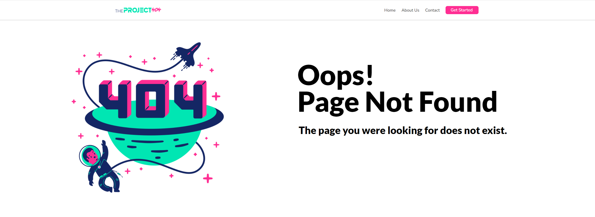

<h1>theProject404</h1>

Um simples projeto de landing page, utilizando somente HTML+CSS puro, simulando a famosa página do erro 404 (Page Not Found)

  <h2>Screenshot</h2>

<em>Abaixo, uma screenshot demonstrando basicamente o layout final do projeto</em>

  <h2>ícone Header</h2>
  

<em>O ícone a seguir eu fiz rapidamente utilizando Photoshop, utilizando a mesma paleta de cores da imagem principal da página</em>

  
  <h2>Isso é tudo.</h2>
  
Obrigado!

  
  
